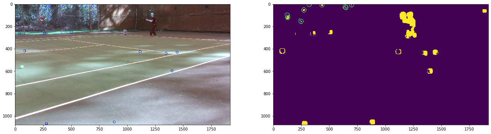

# Tennis Game Analysis

###### Written by Moishe Keselman and his cleverly named alter ego: James Keselman

The code in [Court Detection.ipynb](./pictures/Court%20Detection.ipynb) beautifully detects court lines and corners. 
In that file, I began work on camera rotation matrices to later create a 3D model of the court, player and ball.

The code in [Tennis Ball Tracking New.ipynb](./Tennis%20Ball%20Tracking%20New.ipynb) contains image detection techniques including: 
thresholding, Optical Flow, Connected Components, and Convolutional Neural Networks.

Currently, the methods aren't working perfectly, but the algorithm is able to pick up the true ball as a ball candidate in the picture below:

###### RED circles is the ground truth, BLUE circles are ball candidates, YELLOW regions are areas of high optical flow. 

The code in [Model Training.ipynb](./Model%20Training.ipynb) trains a small CNN to classify ball candidate images. 
The model is trained on images generated from [Negative Data Collection.ipynb](Negative%20Data%20Collection.ipynb) 
and [Positive Data Collection.ipynb](Positive%20Data%20Collection.ipynb). 
The code in the data collection notebooks cuts small ball and non-ball images (respectively) out of videos, augments them (color, size, shape), and stores them in CSV files. 
